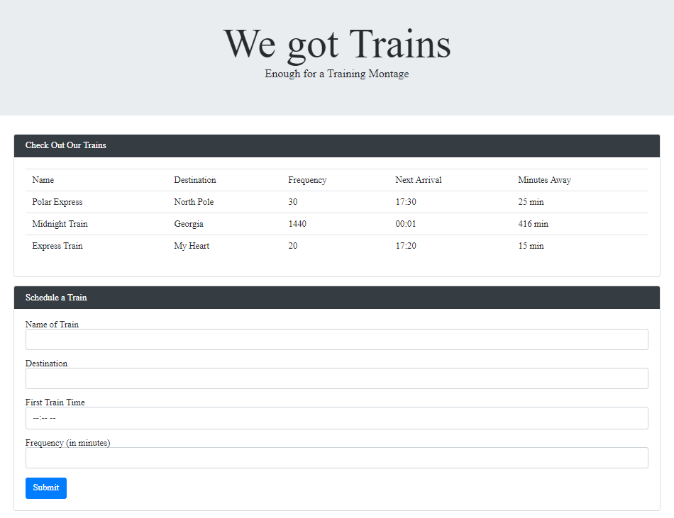

# Train-Scheduler
Using Firebase and Moment.js to create a dynamic train scheduler that stores user inputted information in the cloud, and performs real-time calculations based off of that data.

# Link to Deployed Site
[Schedule some trains!](https://aehaq.github.io/Train-Scheduler/)

# Images


# Technology Used
- HTML
- CSS (Bootstrap)
- JavaScript (jQuery)
- Moment.js
- Google Firebase

# Code Snippets
```
function firstArrival(initialVal) {
    var firstArrival = moment(initialVal, "hh:mm a")
    return firstArrival
};

function nextArrival(firstArrival, interval) {
    var nextArrival = firstArrival;
    
    while (moment().diff(nextArrival, 'minute') > 0) {
        nextArrival = nextArrival.add(interval, 'minute') 
    }
    return nextArrival;
};

function timeUntil(nextArrival) {
    var timeUntil = moment().diff(nextArrival, 'minute') * -1
    return timeUntil;
};
```
These three short functions were the key to succesfully maintaining an up to date schedule. Any time information was pulled from firebase, these three functions would run to ensure that regardless of when these values were created, the values displayed would be timely. The first function simply converts the scheduled trains arrival time into a format that is ready for both display and calculation. The second function cycles through each instance of the train's scheduled arrivals until it is up to date, and ready to display the next arrival. The time until the next train very simply takes the numerical difference in minutes between the current time and the next arrival. Since these three functions are always run upon data retrieval, and the data is checked every ten seconds, you will never get outdated information.

# Learning Points
- Pushing user-generated information to the firebase server to be stored alongside all previously submitted data.
- Pulling information from firebase on page load as well as upon usersubmission of new data.
- Using moment.js to reformat time values stored as strings for display and computational purposes.
- Using while loops to initialize display data that is always up-to-date.
- Understanding the nuances of html form input types, to promote ease of future computations.
- Understanding and working around the normal parameters of the firebase snapshot feature.
- Updating displayed database information at regular intervals.

# Author 
Azfar Haq - [GitHub](https://github.com/aehaq)

# License
Standard MIT License